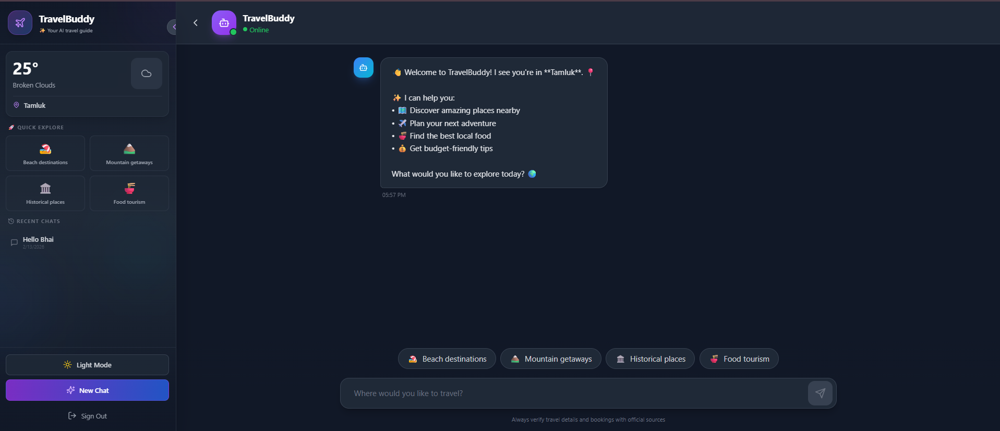
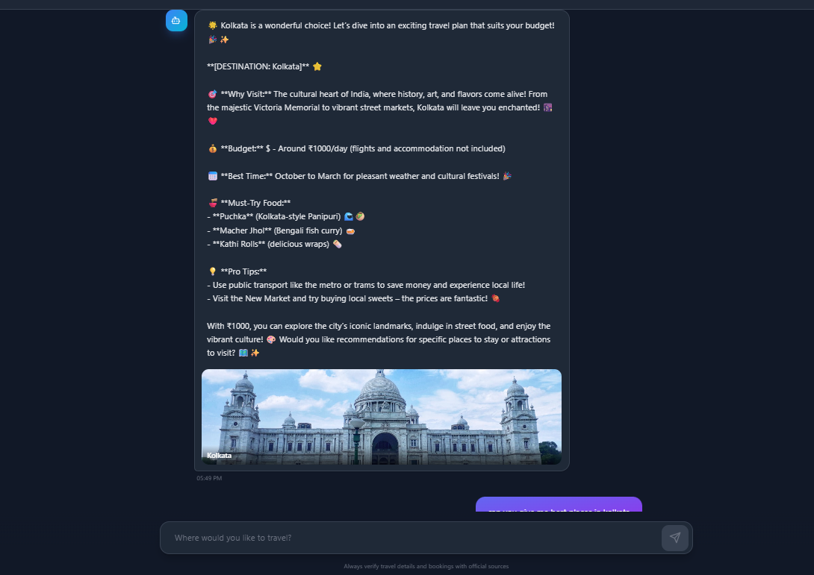
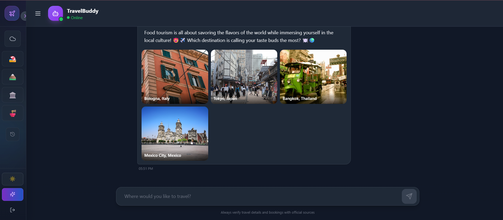

# ✈️ TravelBuddy - AI Travel Planning Assistant

<p align="center">
  
</p>

<p align="center">
  <strong>Your Personal AI-Powered Travel Companion</strong>
</p>

<p align="center">
  <a href="#features">Features</a> •
  <a href="#screenshots">Screenshots</a> •
  <a href="#tech-stack">Tech Stack</a> •
  <a href="#getting-started">Getting Started</a> •
  <a href="#environment-variables">Environment Variables</a>
</p>

---

## 🌟 Overview

TravelBuddy is a modern, frontend-only AI travel planning assistant that helps you discover amazing destinations, get personalized travel recommendations, and plan your perfect trip. Built with Next.js and powered by Gemini AI with Puter.js fallback.

---

## ✨ Features

- 🤖 **AI-Powered Recommendations** - Get intelligent travel suggestions using Gemini AI
- 🌍 **Location Detection** - Automatic location detection for personalized recommendations
- 🌤️ **Live Weather** - Real-time weather information for your location
- 🖼️ **Destination Images** - Beautiful images from Unsplash for every destination
- 🌙 **Dark/Light Theme** - Toggle between dark and light modes with persistence
- 💬 **Chat History** - Save and revisit your previous travel conversations
- 📱 **Fully Responsive** - Works beautifully on desktop, tablet, and mobile
- 🔐 **Puter.js Authentication** - Secure sign-in with Puter.js
- ⚡ **Fast & No Backend** - 100% frontend, no server required

---

## 📸 Screenshots

### Login Page



### Chat Interface - Light Mode



### Chat Interface - Dark Mode



---

## 🛠️ Tech Stack

| Technology         | Purpose                               |
| ------------------ | ------------------------------------- |
| **Next.js 14**     | React Framework with App Router       |
| **Tailwind CSS**   | Styling & UI Components               |
| **Puter.js**       | Authentication & Cloud Storage        |
| **Gemini AI**      | Primary AI for travel recommendations |
| **Unsplash API**   | Destination images                    |
| **OpenWeatherMap** | Weather data                          |
| **Lucide React**   | Beautiful icons                       |

---

## 🚀 Getting Started

### Prerequisites

- Node.js 18+ installed
- npm or yarn package manager

### Installation

1. **Clone the repository**

   ```bash
   git clone https://github.com/yourusername/traveling-ai-agent.git
   cd traveling-ai-agent
   ```

2. **Install dependencies**

   ```bash
   npm install
   ```

3. **Set up environment variables**

   Create a `.env.local` file in the root directory:

   ```env
   NEXT_PUBLIC_GEMINI_KEY=your_gemini_api_key
   NEXT_PUBLIC_WEATHER_KEY=your_openweathermap_api_key
   NEXT_PUBLIC_UNSPLASH_KEY=your_unsplash_access_key
   ```

4. **Run the development server**

   ```bash
   npm run dev
   ```

5. **Open in browser**

   Navigate to [http://localhost:3000](http://localhost:3000)

---

## 🔑 Environment Variables

| Variable                   | Description                            | Required |
| -------------------------- | -------------------------------------- | -------- |
| `NEXT_PUBLIC_GEMINI_KEY`   | Google Gemini API key for AI responses | Yes      |
| `NEXT_PUBLIC_WEATHER_KEY`  | OpenWeatherMap API key                 | Optional |
| `NEXT_PUBLIC_UNSPLASH_KEY` | Unsplash API access key for images     | Optional |

### Getting API Keys

- **Gemini API**: [Google AI Studio](https://makersuite.google.com/app/apikey)
- **OpenWeatherMap**: [OpenWeatherMap API](https://openweathermap.org/api)
- **Unsplash**: [Unsplash Developers](https://unsplash.com/developers)

---

## 📁 Project Structure

```
traveling-ai-agent/
├── app/
│   ├── chat/
│   │   └── page.js        # Main chat interface
│   ├── login/
│   │   └── page.js        # Login page
│   ├── globals.css        # Global styles
│   ├── layout.js          # Root layout
│   └── page.js            # Home page (redirects)
├── constants/
│   └── prompts.js         # AI system prompts
├── public/
│   ├── icon.svg           # App favicon
│   ├── 1.png              # Screenshot 1
│   ├── 2.png              # Screenshot 2
│   └── 3.png              # Screenshot 3
├── .env.local             # Environment variables
├── package.json
├── tailwind.config.js
└── README.md
```

---

## 🎨 Features in Detail

### 🤖 AI Chat

- Natural language travel queries
- Context-aware responses
- Emoji-rich, engaging answers
- Automatic destination detection for images

### 🌙 Theme Toggle

- Smooth dark/light mode transition
- Theme preference saved to cloud via Puter.js
- Beautiful gradient sidebar adapts to theme

### 💾 Chat History

- Automatically saves conversations
- Quick access to recent chats (up to 10)
- Delete individual chats
- Stored securely with Puter.js KV storage

### 📍 Location & Weather

- Automatic geolocation detection
- Real-time weather display
- Weather-based travel recommendations

---

## 🤝 Contributing

Contributions are welcome! Please feel free to submit a Pull Request.

1. Fork the project
2. Create your feature branch (`git checkout -b feature/AmazingFeature`)
3. Commit your changes (`git commit -m 'Add some AmazingFeature'`)
4. Push to the branch (`git push origin feature/AmazingFeature`)
5. Open a Pull Request

---

## 📄 License

This project is licensed under the MIT License - see the [LICENSE](LICENSE) file for details.

---

## 🙏 Acknowledgments

- [Puter.js](https://puter.com) - For authentication and cloud storage
- [Google Gemini](https://ai.google.dev) - For AI capabilities
- [Unsplash](https://unsplash.com) - For beautiful destination images
- [OpenWeatherMap](https://openweathermap.org) - For weather data
- [Lucide](https://lucide.dev) - For beautiful icons

---

<p align="center">
  Made with ❤️ for travelers worldwide
</p>

<p align="center">
  <strong>Happy Traveling! 🌍✈️🗺️</strong>
</p>
